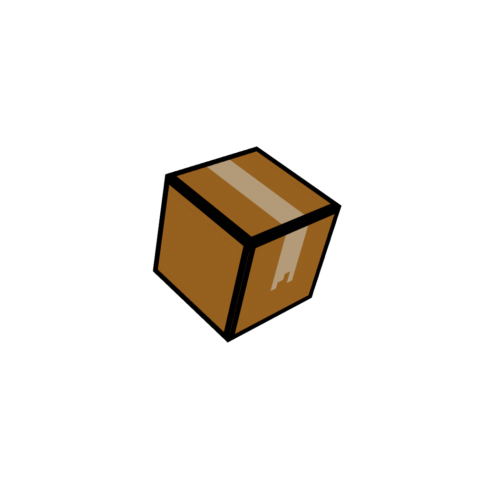

# A Package of Fun
### [Mine and Clayton Collin's entry](https://wiggleforlife.itch.io/a-package-of-fun) for the [2020 Quarantine Jam](https://itch.io/jam/ndab-jam)
Theme - "pack"  
This was originally meant to be a "package" of minigames featuring a "package" as the "main character..." here we are with one.  
The menu is 3D, but the actual game is all 2D. It features 
* A platformer
* That's it

I think this was a great exercise, as it was my first *complete* Unity project, as well as my first game jam. I gained a lot of experience with the Unity engine in a short amount of time. However, it's bad to the point where it's made for an Ultrawide monitor and nothing else... leaving it basically unplayable unless you know the levels - unless you skip them all using my crappy collider system.

# Credits:
* Me - programmer, artist, minigame designer
* Clayton Collins - musician, level designer, minigame designer

This will most likely never be updated and I'll probably archive it. I just wanted to upload this to GitHub so I could access the code remotely... if I wanted to do that for some reason. This is full of buggy code and bad practises.
